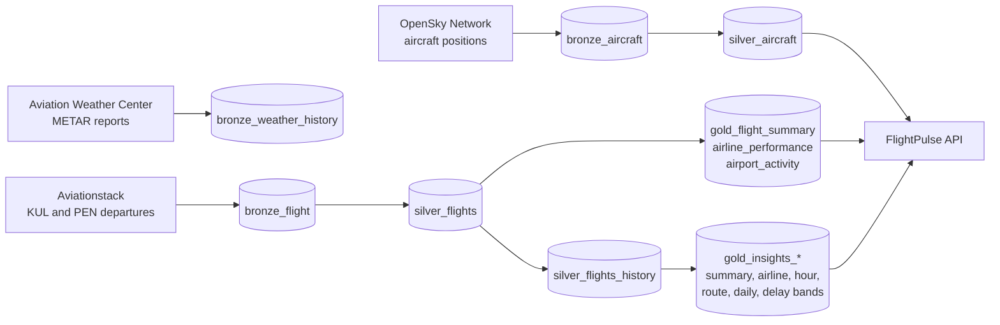

# FlightPulse Pipeline

The Databricks data pipeline behind [FlightPulse](https://flightpulse-frontend.vercel.app): it loads live aircraft positions, flights and airport weather, cleans them, keeps a day-by-day history and builds the delay insight tables that the [API](https://github.com/MUMBA-Amos/flightpulse-api) serves to the [website](https://github.com/MUMBA-Amos/flightpulse-frontend).

## Architecture



Bronze holds raw data as loaded, Silver holds cleaned data and history, and Gold holds tables shaped for the website (a **medallion architecture** on **Delta Lake**).

## Notebooks

| Notebook | Layer | What it does |
|---|---|---|
| `01_ingest_opensky` | Bronze | Loads the latest OpenSky snapshot (~12,000 aircraft) into `bronze_aircraft`, and appends the latest weather reports for Kuala Lumpur and Penang to `bronze_weather_history` (merged, so each report is stored once) |
| `01.1_ingest_AviationStack` | Bronze | Loads the day's landed departures from KUL and PEN into `bronze_flight`, within the free plan's ~100 calls a month |
| `02a_transform_silver_aircraft` | Silver | Cleans the aircraft snapshot: one row per aircraft, positions only, readable timestamps |
| `02b_transform_silver_flights` | Silver | Cleans the flights, merges codeshare duplicates, and upserts them into `silver_flights_history` with a Delta MERGE |
| `03_transform_gold` | Gold | Builds the flight summary, airline and airport tables, and the delay insight tables in Spark SQL |

## Jobs

| Job | Schedule | Tasks |
|---|---|---|
| Aircraft | Hourly | `01_ingest_opensky` → `02a_transform_silver_aircraft` |
| Flights | Daily, 23:30 Malaysia time | `01.1_ingest_AviationStack` → `02b_transform_silver_flights` → `03_transform_gold` |

## Key design decisions

- **Codeshare de-duplication.** Aviationstack returns one row per flight number, so one plane sold by several airlines appeared up to 16 times. Silver maps each codeshare row to the operating flight (using Aviationstack's `codeshared` field) and also matches copies by route, departure minute and gate, so each flight is counted once, under the airline that flies it.
- **Unbiased sampling on a free plan.** A call returns at most 100 flights, earliest first, and KUL has several hundred departures a day, so a fixed call only ever saw the morning. Each night starts at a different offset, so every hour of the day is covered over about a week, still with one call per airport per night.
- **Incremental history.** Bronze and the latest Silver are overwritten each run, but `silver_flights_history` is updated with a Delta **MERGE** keyed on flight date and flight number, so re-fetched flights are updated rather than duplicated.
- **Standard metrics.** A departure is **on time** if it leaves no more than **15 minutes** after schedule, the usual industry definition. Delay is actual minus scheduled departure (early counts as 0). Groups with fewer than 5 flights aren't ranked.
- **Local times.** Aviationstack gives local airport times labelled as UTC, so the Gold SQL reads them in UTC to keep the local hour unchanged.

## Setup

Runs on Databricks (Free Edition works) with Unity Catalog tables in `workspace.default`.

1. Import the notebooks into your workspace.
2. Store your Aviationstack key as a secret; the notebooks never contain it:
   ```bash
   databricks secrets create-scope flightpulse
   databricks secrets put-secret flightpulse aviationstack_key
   ```
3. Create the two jobs above on serverless compute.

## Data sources

[OpenSky Network](https://opensky-network.org) (aircraft positions; free data for non-commercial use), [Aviationstack](https://aviationstack.com) (flights and delays; free plan) and the [Aviation Weather Center](https://aviationweather.gov) (METAR weather).
